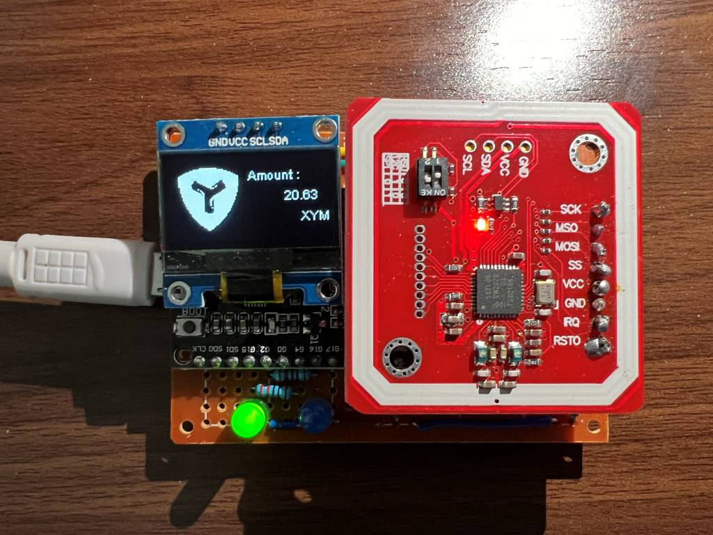
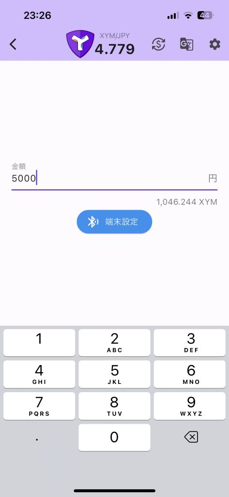
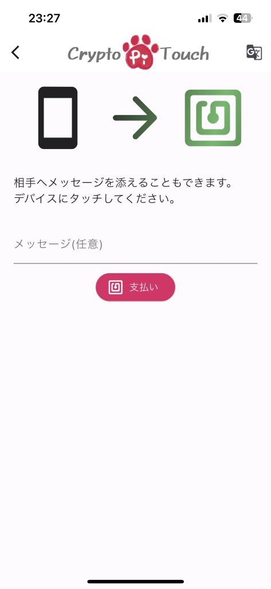
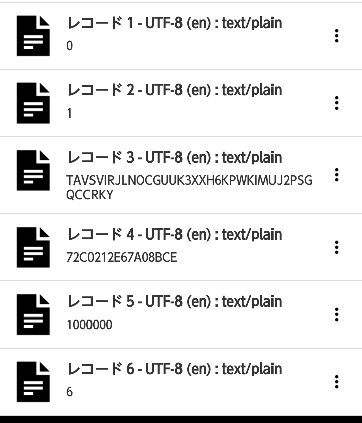

# CryptoPiTouch NEMTUSHackathon

CryptoPiTouch for NEMTUS Hackathon 2024 Submission Repository  
[日本語ページはこちらをクリックしてください。](https://github.com/TGVRock/CryptoPiTouch_NEMTUSHackathon/blob/master/README.md)

- [NEMTUS Hackathon 2024 Landing Pages](https://hackathon-2024.nemtus.com/)
- [NEMTUS Hackathon 2024 Works List Page](https://nemtus-hackathon.web.app/years/2024/results)

## Overview

This is a crypto touch payment system that utilizes NFC.  
This system consists of a terminal device for passing payment information and a mobile application that communicates with the terminal device.

### Terminal Device

It has a quota allocation that mediates settlement information.  
Communicates with mobile apps via Bluetooth, RFID module.

### Mobile Application

There will be two types of pages, one to be operated by the store and one to be operated by the customer.  
In this submission, we have made it possible to perform both operations with a single application, but in the future there will be two types of applications, one for the store side and one for the customer side.

#### Pages operated by the store

The operation on the store side uses Bluetooth to set up the payment information (network and address of the account to receive, and quantity) to the terminal device.

#### Pages operated by the customer

The operation on the customer side reads the payment information set in the terminal device by NFC.  
From the read payment information, another signature app/wallet app is launched to sign and announce the payment.  
For this reason, this application does not require the input of a private key, and the payment can be made with the signing app/wallet app that is normally used.

#### Supported Chains and Signature Apps and Wallet Apps

- Symbol
  - aLice
- Ethereum
  - Metamask
- Astar
  - Metamask

\* Supported chains and signature and wallet applications will be added in future correspondence.

## Application Distribution

For this hackathon submission, only Android will be distributed. (at the time of submission of deliverables)

[CryptoPiTouch Beta (arm64-v8a)](apps/crypto-pi-touch-beta.apk)

For older models, the application may not start.
Please try the following apps as well.

[CryptoPiTouch Beta (armeabi-v7a)](apps/crypto-pi-touch-beta-armeabi-v7a.apk)  
[CryptoPiTouch Beta (x86_64)](apps/crypto-pi-touch-beta-x86_64.apk)

We have confirmed that it also works on iOS, and our goal is to distribute it on the App Store / Google Play in the future.

## Demo

Due to its large capacity, viewing over Wi-Fi is recommended.

### Symbol

- [YouTube](https://youtu.be/LwDMi24dl0c)
- [Video files](demos/demo_symbol.mp4)

### Ethereum

- [YouTube](https://youtu.be/lR5RxytIIMo)
- [Video files](demos/demo_ethereum.mp4)

### Astar

- [YouTube](https://youtu.be/ZdSgLeBOu8I)
- [Video files](demos/demo_astar.mp4)

## [For Hackathon Evaluation] Usage

### Operation on the store side (Store Page)

Please use the demo video as a reference for other than terminal settings.

### Operation on the customer side (Touch Payment Page)

You can simulate the experience by writing specific information to your NFC tag.

| Record No. | Data to be written     | remarks                                                                                                    |
| -----------: | ------------------ | ------------------------------------------------------------------------------------------------------- |
|            1 | chain identifier   | `0` : Symbol `1` : Ethereum `2` : Astar                                                           |
|            2 | network identifier | `0` : Mainnet `1` : Testnet                                                                |
|            3 | address            | For EVM-based chains addresses, prefix the address with `0x`.                                               |
|            4 | mosaic ID          | Symbol only; set to `0` for EVM-based chains                                                 |
|            5 | amount             | Set the quantity in consideration of divisibility. (In case of sending 1XYM by Symbol, set `1000000`; in case of EVM chain, set value in Gwei). |
|            6 | divisibility       | Symbol : `6` EVM-based chains : `9`                                                                     |

## Examples of applications other than touch payment

- Authentication
  - Example implementation: Pass account information to the terminal and check if it has a specific token.
  - Practical examples: smart keys, ticket authentication for events, etc..
  - [An image video is available at X (formerly Twitter) !](https://twitter.com/maromaro1989/status/1774095223700042230?s=20)

## Contact us

Comments, questions, bug information, anything is welcome!

- X (formerly Twitter)
  - hashtag : #CryptoPiTouch #NEMTUSHackthon #ハッカタス
  - [まめしば](https://twitter.com/maromaro1989)
  - [だーりんピ](https://twitter.com/darling_pi_)
    - Please menshion, or DM after mutual follow.

## Troubleshoot

- Unexpected error in terminal settings.
  - Check if Bluetooth is enabled.
  - Try deleting the pairing settings from the phone's settings once.
- Metamask opens after touch, but no signature dialog appears
  - This happens occasionally. The cause and countermeasure are under investigation.  
    Try closing the WalletConnect session from the Metamask settings and then touch again.

## TODO

The following behaviors and events are currently not supported, but we would like to address them in the future.

### Unimplemented items

- Separate apps
- Operation when signature is canceled in the linked signature app or wallet app
  - After returning to this app, the loading completion dialog will remain displayed and cannot be retried or cancelled.
  - It can be reset by returning to the Home screen.
- Operation when a chain other than the one to be used for payment is selected in Metamask
  - The network is changed on the Metamask side, but after that, it works the same way as the signature cancellation.
- Creating a Retry Mechanism

### Currently known defects

- ✅ [Completed] ~~[iOS] The first time after launching the app, the device setup always fails.~~
  - Fix completed.

### What we want to improve

- ✅ [Completed] Enable real-time updating of transaction prices.
- Notification
  - when approval is given
  - ✅ [Completed] when payment is received
  - EVM system in general
- Store side page : EVM chain QR readable
- Store side page : EVM chain receipt history
- ✅ [Completed] Store side page: Retention of last selected chain
- Store side page : I want to make it look like a calculator UI
- Create terminal exterior
- Expansion of supported chains and wallets
