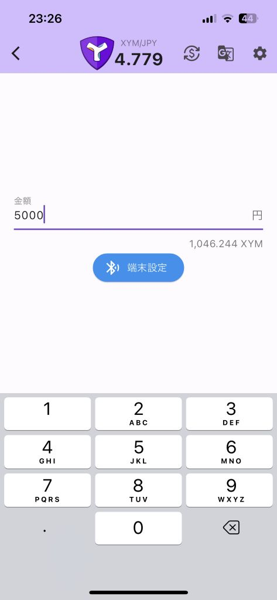
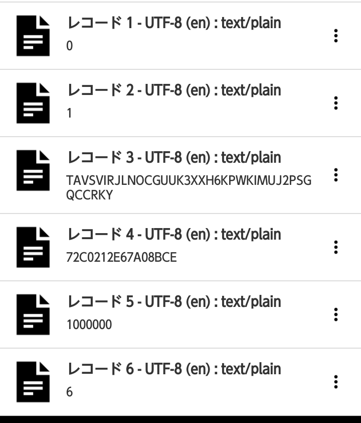

# CryptoPiTouch NEMTUSHackathon

CryptoPiTouch for NEMTUSハッカソン2024提出用リポジトリ

- [NEMTUSハッカソン2024 ランディングページ](https://hackathon-2024.nemtus.com/)
- [NEMTUSハッカソン2024 作品一覧ページ](https://nemtus-hackathon.web.app/years/2024/results)

## 概要

NFC を活用したクリプトタッチ決済システムです。  
本システムは、決済情報を受け渡すための端末機器と、端末機器と通信するモバイルアプリで構成されています。

### 端末機器

決済情報を仲介する枠割を持ちます。  
Bluetooth, RFIDモジュールを通してモバイルアプリと通信します。

### モバイルアプリ

お店側で操作するページ、お客さん側で操作するページの2種類に分かれます。  
今回の提出では1アプリで両方の操作ができるようにしていますが、今後はお店側のアプリ、お客さん側のアプリの2種類に分かれます。

#### お店側で操作するページ

お店側の操作では、Bluetoothを使って端末機器への決済情報(受け取るアカウントのネットワーク、アドレス、数量)を設定します。

#### お客さん側で操作するページ

お客さん側の操作では、NFCによって端末機器に設定されている決済情報を読み取ります。  
読み取った決済情報から、他の署名アプリ・ウォレットアプリを起動して署名・アナウンスを行います。  
このため、本アプリでは秘密鍵を入力する必要なく、普段使用している署名アプリ・ウォレットアプリで決済できます。

#### 対応チェーンと署名アプリ・ウォレットアプリ

- Symbol
  - aLice
- Ethereum
  - Metamask
- Astar
  - Metamask

※対応チェーンと署名アプリ・ウォレットアプリは、今後の対応で追加していきたいと思います。

## アプリ配布

今回のハッカソン提出では Android のみの配布となります。(成果物提出時点)

[CryptoPiTouch Beta (arm64-v8a)](apps/crypto-pi-touch-beta.apk)

古い機種の場合、アプリが起動しないことがあります。
以下のアプリもお試しください。

[CryptoPiTouch Beta (armeabi-v7a)](apps/crypto-pi-touch-beta-armeabi-v7a.apk)  
[CryptoPiTouch Beta (x86_64)](apps/crypto-pi-touch-beta-x86_64.apk)

iOS でも動作することは確認しておりますので、将来的には App Store / Google Play での配信を目標にしております。

## デモ動画

Wi-Fi環境での視聴推奨です。

### Symbol

- [YouTube](https://youtu.be/LwDMi24dl0c)
- [動画ファイル](demos/demo_symbol.mp4)

### Ethereum

- [YouTube](https://youtu.be/lR5RxytIIMo)
- [動画ファイル](demos/demo_ethereum.mp4)

### Astar

- [YouTube](https://youtu.be/ZdSgLeBOu8I)
- [動画ファイル](demos/demo_astar.mp4)

## 【ハッカソン評価用】 使い方

### お店側の操作 (店舗ページ)

端末設定以外についてはデモ動画を参考にご使用ください。

### お客さん側の操作 (タッチ決済ページ)

お手持ちのNFCタグに特定の情報を書き込むことで疑似体験できます。

| レコード番号 | 書き込むデータ     | 備考                                                                                                    |
| -----------: | ------------------ | ------------------------------------------------------------------------------------------------------- |
|            1 | チェーン識別子     | `0` : Symbol `1` : Ethereum `2` : Astar                                                           |
|            2 | ネットワーク識別子 | `0` : メインネット `1` : テストネット                                                                |
|            3 | アドレス           | EVM系チェーンのアドレスの場合は先頭に`0x`をつけてください                                               |
|            4 | モザイクID         | Symbol のみ。EVM系チェーンの場合は`0`を設定してください                                                 |
|            5 | 数量               | 可分性を考慮した数量を設定してください。(Symbol で1XYM送る場合は `1000000` 。EVM系チェーンは Gwei 単位) |
|            6 | 可分性             | Symbol : `6` EVM系チェーン : `9`                                                                     |

## 連絡先

感想、質問、不具合情報、なんでも大歓迎です！

- X (旧Twitter)
  - ハッシュタグ : #CryptoPiTouch #NEMTUSHackthon #ハッカタス
  - [まめしば](https://twitter.com/maromaro1989)
  - [だーりんピ](https://twitter.com/darling_pi_)
    - メンション、または相互フォロー後DMでお願いします。

## トラブルシュート

- 端末設定で予期せぬエラーになる
  - Bluetooth が有効になっているか確認してください。
  - スマホの設定からペアリング設定を一旦削除してみてください。
- タッチ後 Metamask は開くが、署名ダイアログが表示されない
  - たまになります。原因・対策は調査中です。  
    Metamask の設定から WalletConnect セッションを終了後、再度タッチしてみてください。

## TODO

以下の挙動・事象は現状未対応ですが、将来的に対応したいと思います。

### 未実装項目

- アプリを分ける
- 連携先の署名アプリ・ウォレットアプリで署名キャンセルされた場合の動作
  - 本アプリに戻った後、読み込み完了ダイアログが表示されたままとなり、再試行もキャンセルもできません。
  - ホーム画面に戻ることでリセットできます。
- Metamask で、決済するチェーン以外が選択されていた場合の動作
  - Metamask 側でネットワーク変更されますが、その後は署名キャンセル同様の動作になります。
- 再試行の仕組みづくり

### 現在判明している不具合

- [iOS] アプリ起動後、初回の端末設定が必ず失敗します。
  - 二回目以降は大丈夫です。

### 改善したいこと

- ✅ [完了] 取引価格をリアルタイム更新できるようにする。
  - 現在は店舗側ページが開いた時・受取アドレスを変更した時のみ更新される。
- 通知 (承認になった時、着金時、EVM系全般)
- 店舗側ページ : EVMチェーンのQR読み取り対応
- 店舗側ページ : EVMチェーンの受取履歴
- 店舗側ページ : 前回選択チェーンの保持
- 店舗側ページ : 電卓っぽいUIにしたい
- 端末の外装を作る
- 対応チェーン・ウォレットの拡充
